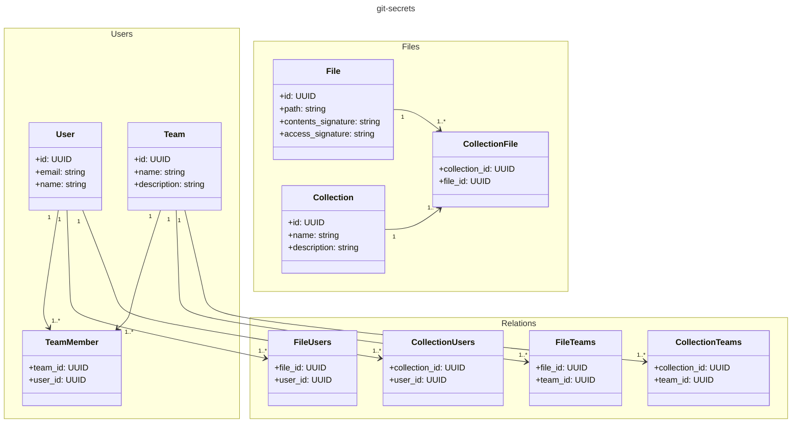

# Database structure

## Users and Teams

```mermaid
---
title: git-secrets
---
classDiagram
    %% Classes
    namespace Users {
        class User {
            +id: UUID
            +email: string
            +name: string
        }

        class Team {
            +id: UUID
            +name: string
            +description: string
        }

        class TeamMember {
            +team_id: UUID
            +user_id: UUID
        }
    }

    namespace Files {
        class File {
            +id: UUID
            +path: string
            +contents_signature: string
            +access_signature: string
        }

        class Collection {
            +id: UUID
            +name: string
            +description: string
        }

        class CollectionFile {
            +collection_id: UUID
            +file_id: UUID
        }
    }

    namespace Relations {
        class FileUsers {
            +file_id: UUID
            +user_id: UUID
        }

        class FileTeams {
            +file_id: UUID
            +team_id: UUID
        }

        class CollectionUsers {
            +collection_id: UUID
            +user_id: UUID
        }

        class CollectionTeams {
            +collection_id: UUID
            +team_id: UUID
        }
    }

    %% Links
    User "1" --> "1..*" TeamMember
    Team "1" --> "1..*" TeamMember
    File "1" --> "1..*" CollectionFile
    Collection "1" --> "1..*" CollectionFile
    User "1" --> "1..*" FileUsers
    Team "1" --> "1..*" FileTeams
    User "1" --> "1..*" CollectionUsers
    Team "1" --> "1..*" CollectionTeams
```
